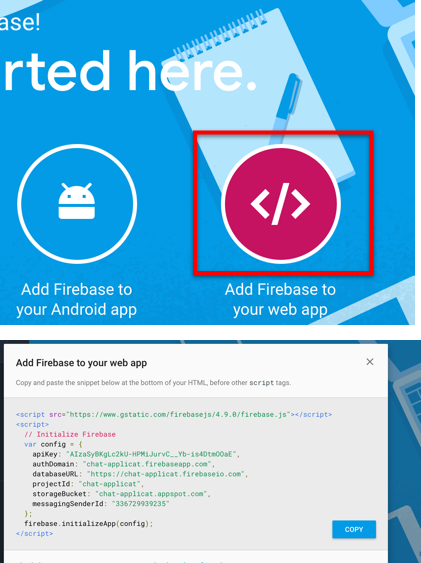
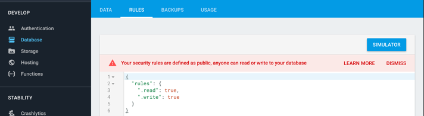

# A very simple firebase javascript chat application
 
 ## Setup 
 
 You'll want to update the config `<script>` block to your 
 own application:
 
 1) Clone this repo, in terminal type `https://github.com/joeappleton18/firebase_chat_app.git`
 
 1) Set up a firebase account 
 
 2) Create a new database 
  
 3) Click 'Add Firebase to your web app' from your developer console.  Copy the information and override my config info in `index.html`
 
 
 
  >> Getting the config information

  
 4) Relax the security rules of your database. By default for a browser to access a database, a user needs to be authenticated. You may not want this straight away. Select your database and click on rules. Set them to 
 
 
 
 ```javascript
 
 {
  "rules": {
    ".read": true,
    ".write": true
  }
} 
 
 ```
  
 
 
 >> Relaxing the security rules